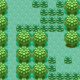
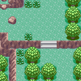

# Image Generator

Given a tiled image, compute a cellular automata and compute related images using it.

Using markov chain inspired techniques.

example output using 'petalburg woods.png'

example output using 'safari zone.png'

more examples can be seen in [out](out/)
